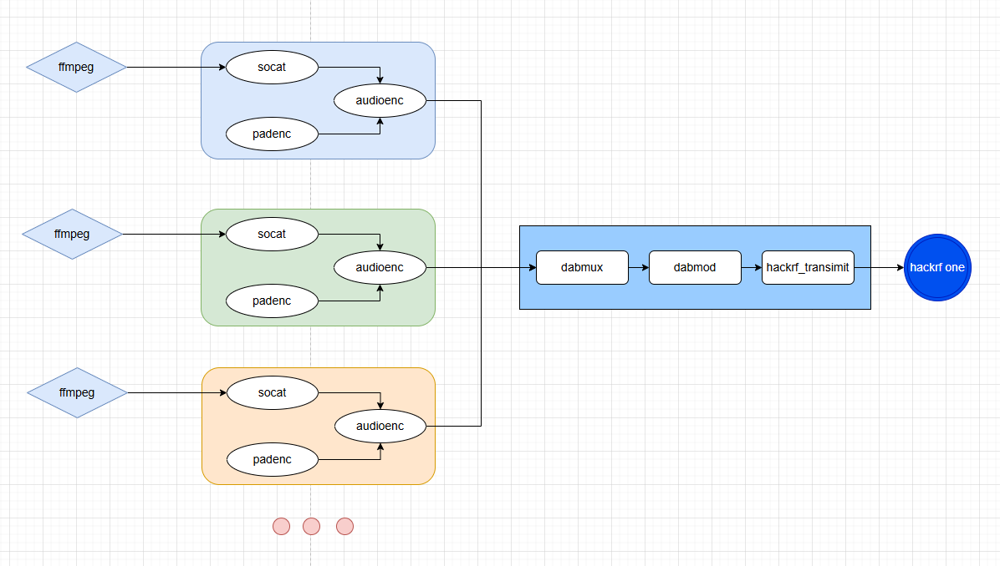
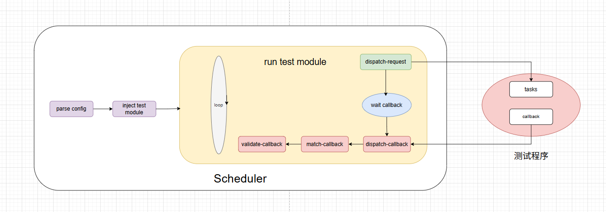

<h1 align="center">Auto Closed Loop Test</h1>

## 简要说明

- `odr_executor`：负责管理 ODR Tools 工具、 FFmpeg 以及 HackRf 设备,提供状态监听接口
- `scheduler`：负责调度测试流程，执行测试套件中的测试用例，并且提供状态监听接口

## ODR Executor

### 运行框架图

### 设计考量

- **guard.py核心模块** 
    - 统一管理外部进程的生命周期，主要用来自动拉起崩溃进程，并且提供统一的接口供上层调用。因为odr工具链不是单一的程序，涉及到多个关联程序之间的协同，如果其中一个程序崩溃，有极大可能影响其他程序，guard的自动重启功能可以在程序崩溃的时候自动拉起，提升系统的稳定性和可靠性

- **stable_session 和 active_session**
    - 因为`dabmux` `dabmod` `hackrf` 在系统工作时，只需要运行一个实列，并且有很强的关联性，所以用stable_session统一管理， 而`socat` `padenc` `audioenc` 在系统运行时，一个subchannel对应一套,所以使用active_session管理，使用socat的输入port作为区分。然后使用session_manager统一管理

- **router路由**
    - 所有的api都使用表单的形式，主要是为了方便直接利用fastapi提供的docs接口，可以更方便的进行参数设置。后续如果需要提供前端页面的时候可以考虑改成json的形式。
- **有名管道通信**
    - 因为设计目标是单机上运行，所以为了使用简单高效，强关联的程序都采用了管道的通信方式
- **参数配置**
    - 在dab音频发射中，一些固定配置就不提供额外的配置选项，比如ffmpeg中的采样等等。**特别说明：** 因为ffmpeg在播放音频的时候需要控制播放速率，但是通过测试发现如果使用readrate 0 的配置会导致读取速率变慢，出现音频断断续续的情况，所以参数里固定使用1.06的配置，如果直接采样声卡则不会出现这个问题,原因初步分析应该是ffmpeg通过算法模拟的时钟频率不准确。

### 使用说明
为了方便管理和使用便捷，所有的会话或程序都采取先配置再启动的策略。
**特别注意：** active配置有port和output_port。 其中output_port对应dabmux配置文件中subchannel的inputuri字段的输入端口，而port则是socat的输入端口，并且也是区分不同active的唯一键。例如，现在subchannel中的sub-music的inputuri为"tcp://127.0.0.1:9000"，则acvive中的output_port就应为9000； 然后ffmpeg的推送地址的port为5656，则active中的port字段就应为5656，以此类推，ffmpeg配置也是同理。

## Scheduler
### 运行框架图

### 设计考量

- **模块化测试流程编排**
    - 考虑后期添加测试模块的便捷性，以及测试流程的灵活性，利用python的动态注入功能，动态添加测试模块。

- **CompletionPolicy**
    - 引入完成策略控制是为了应对不同的测试情况。目前包含以下几种回调匹配策略：
        1. **exactly(n):** 收到第 `n` 条匹配回调时立即完成（当前实现是“达到 n 即返回”，不是最终总数必须严格等于 `n`）
        2. **at_least(n):** 至少收到 `n` 条匹配回调才完成；达标后会继续把队列中当前可匹配的回调一并收集
        3. **any_one():** 任意收到 1 条匹配回调即完成
        4. **until(stop_when):** 持续收集回调，直到回调满足 `stop_when(callback) == True` 才完成。例如在切换台的时候，只有dls和sls都匹配才能算成功。
        5. **time_window_collect(window_seconds):** 从触发窗口开始，在指定时间窗口内收集匹配回调，窗口结束后完成。例如在测试音频的时候，可以固定获取指定时长的音频数据，然后进行音频指纹比对。
        6. **MatchPolicy：** 默认 `no_filter`：按 `callback_type/group_id` 进行匹配。通过 `with_request_ids([...])` 启用 `by_request_ids` 后，完成条件会按请求维度生效。
- **ActionPhase**
    - 每个Phase都可以控制测试行为，比如完成策略，超时时间，超时行为，需不需要等待回调，开启request_id检查，最小回调数量等等。

- **callback_type/group_id/request_id过滤回调** 
    - 通过callback_type过滤测试模块，通过group_id过滤phase，通过request_id过滤请求。例如：在切换台操作后，在后续的测试中，还会收到dls和sls或者是音频发送来的回调信息，但是这些对于后续的测试属于不相关回调，可以直接过滤掉。

### 使用说明
如果要添加新的测试模块应按照如下方式进行：
1. 定义ActionPhase
2. 继承BaseParam，添加成员变量，和yaml配置文件中的config字段配置一致
3. 创建log对象并指定tag
4. 继承TemplateAction至少要保证实现build_phase, dispatch_request, _validate_phase_callbacks, _build_request_id, _build_group_id，callback_type，phase_timeout_seconds等方法
5. 修改flows.yaml文件，添加测试配置文件
6. 调用start接口

## ADB 配置和pre_commit脚本使用说明

正常情况下，我们在推送程序到设备中的时候，流程一般是先从开发服务器将编译好的程序通过scp、ftp或者是sftp等软件拉到本地电脑，然后在通过adb push到设备中运行，如果脚本在本地电脑上，这套流程是没有问题的。但是现在如果想要更自动化一点，比如在git commit的时候自动化测试，测试成功就提交，失败就中断提交，则需要在开发服务器上完成程序的推送流程，这个时候可以利用 adb 的 C/S 架构以及 SSH 隧道来实现。adb 的 C/S 架构是实现跨设备控制甚至远程控制的核心原因，比如 WSL，orbstack 等，而 ssh 隧道为该方案提供了链路支撑。

默认情况下，adb 使用5037端口，如果需要修改可以配置环境变量 *ANDROID_ADB_SERVER_PORT* 。使用 adb 前先通过 ssh 将开发服务器的5037端口转发到本地电脑，在本地启动adb server，然后在开发服务器执行 adb 相关命令就可以直接操作本地连接的开发板,比如可以直接在开发服务器上使用adb push 推送程序，或者是adb shell进如设备，本地也可以使用 adb 互不影响。可以将ssh端口转发写入ssh config 配置。最后将 pre_commit 脚本配置到git hooks中，运行commit的时候自动启动脚本测试。

### python 等相关环境问题
因为普通开发者没有权限在开发服务器中安装软件，找管理员也很麻烦，可以使用 moniconda 进行环境管理

## Docker 

如果不想安装程序要用到的各种工具可以使用 Dockerfile 文件一键构建镜像，使用docker-compose.yaml启动容器。